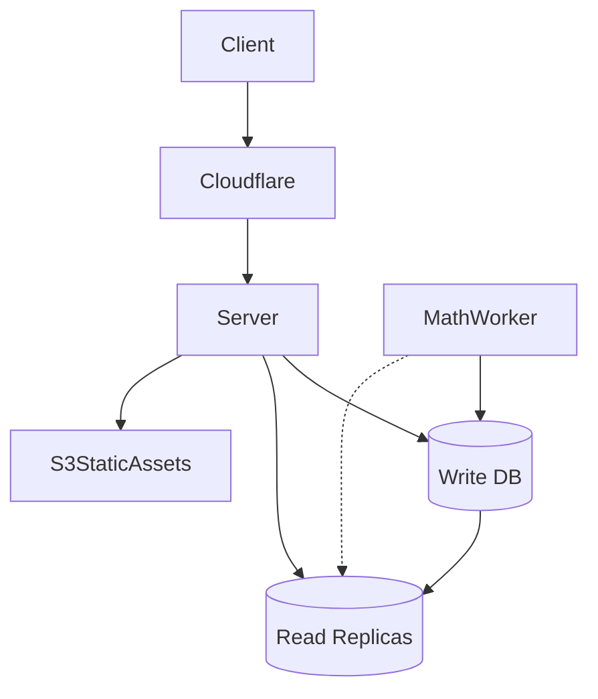

# Scaling and performance roadmap

The purpose of this document is evaluating current peak load capabilities as of December 2022, evaluating potential bottlenecks, and discussing possible mitigations. 

## Background

Polis was architected to scale. We anticipated scaling to many conversations running simultaneously, and many of those conversations being large conversations. As a result, the system is architected from the outset with performance in mind. 

- The [pol.is](http://pol.is) instance is hosted on Heroku, which means we can pay for more server nodes, and beefier math workers.
- We have run a conversation in Germany that had 33,000 participants, with confirmed 10k concurrent users voting simultaneously, with a throughput of up to 65 votes/sec

Large scale usage of polis (defined as greater than 10k concurrent users) is considered an edge case and is not / has not been a primary focus for engineering. Our current level of scaling has been sufficient for regular usage of the tool, and is expected to be in perpetuity since: 

- Many users end up deploying their own infrastructure to own their data after running pilots for some time on the tool, reducing additive load
- Statistical methods — as a method for measuring a population, Polis will never need more than 10,000 people to be successful if it’s a demographically balanced random sample, and 10,000 is a large conversation for nearly all of the work we’ll do. Usually 2,000 people will be sufficiently large, and in many cases even 500 is sufficiently large to map a population if it’s a random sample. Since conversations are burst-y, there are not frequently multiple 1000+ conversations going on simultaneously, though of course it happens.

The part of the system most susceptible to falling over is the math worker. However, in the event that this part of the system does stop running, vote will continue to be collected. While the live report will stop updating for the duration of the outage, the only detriment for real-time data collection is that the comment routing system, which optimizes participants time based on a number of factors, will effectively be “stuck in time”, and unable to adapt to new data:

- new comments in the conversation will have a fixed, moderate routing priority
    - comments with lots of passes or low overall agreement (and thus consensus potential) would continue to be routed at relatively high levels, compared with typical routing
    - conversely, highly relevant comments with high explanatory potential (concordance with main axes of opinion space) or high overall agreement would not be weighted as highly as they might otherwise be
- the axes of the conversation deemed as most significant at the time of the failure will be fixed, and unable to adjust if the dimensions of the emerging opinion space change
- new comments are typically prioritized to give them a chance to “bubble up” so that we get a sense of their relevance early on, and it’s possible that comments being boosted in this fashion at the time of the outage could remain highly boosted for the remainder of the conversation, even if they have low relevance (lots of passes, low overall agreement, poor concordance with main dimensions of the opinion space)

## Architecture

The following diagram shows an overview of the system’s architecture:

Notably, the system has been designed and configured to utilize a primary write database, with read replicas available for read access. This should considerably extend the scalability of the system in terms of voting throughput, since read queries can be offloaded from the main transactor node. However, at present only the server has been set up to utilize the read replicas, but the math worker could be as well.

## Bottlenecks

- Known
    - The maximum number of server nodes we can run with Heroku is 100
    - During our largest conversation to date (33k participants), around a dozen server nodes were required to maintain system responsiveness
    - The number of comments is generally a bigger factor in scaling the math than is the number of participants in a conversation, since the computational complexity of much of the math scales with the number of comments
- Unknown
    - Because Polis servers are set up to write to a single PostgreSQL transactor, at some scale there will be a bottleneck with respect to write throughput, but it’s unknown precisely what this limit is
    - Exact throughput potential of an individual server node

## Potential mitigations

- shut off commenting after n comments (planned, easy)
- add Cloudflare waiting room at certain load (possible, moderate)
- set up the math worker to take advantage of the read replicas (possible, easy-moderate; see [#1581](https://github.com/compdemocracy/polis/issues/1581))
- improve math scalability, applying a number of different strategies (possible, moderate-significant; See [#1579](https://github.com/compdemocracy/polis/issues/1579), [#1580](https://github.com/compdemocracy/polis/issues/1580), [#1602](https://github.com/compdemocracy/polis/issues/1062), [#1061](https://github.com/compdemocracy/polis/issues/1061))
- set up a separate math worker node for the process, making it possible to keep live longer, and not affect the main math worker instance (possible, moderate)

