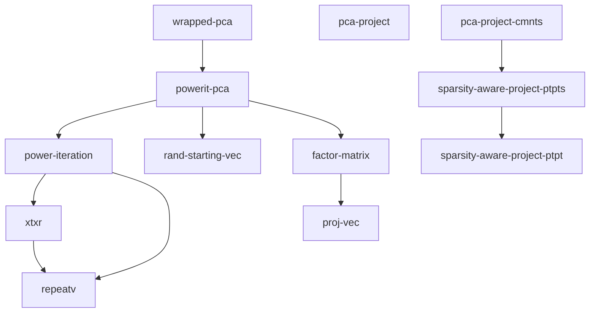

# Pythonizing the math library

This branch is a work in progress, seeing how far we can go with converting the math lib from Clojure to python,
to make it easier to work with, by a broader community, as we look at ML expansion.

**:warning: [DO NOT MERGE, FILED HERE FOR TRACKING PROGRESS!] :warning:**

## Context
We (polis core team and advisors) have been discussing for the least few years about whether Clojure was still the optimal language for the math library, given the evolution of the landscape and of polis needs. 
This came up again when @metasoarous raised potential performance issues https://github.com/compdemocracy/polis/issues/1579#issuecomment-2621457299 . 

Porting any codebase, let alone in this case 7000+ lines of scientific Clojure written by a very smart developer (hats off @metasoarous !), with tons of embedded real-world safeguards, and ten years of battle-testing is a **Very** Big Endeavour, super risky.  Most of all, we need to keep all the domain knowledge that is embedded in the current codebase. **This is *not* a rewrite from a scratch, but a port!**

So, crazy, but there's a lot to gain (massive ML ecosystem: people, libraries, etc), so we would be remiss not to at least explore how far we can go. Worst that can happen is that this completely fails, we lost time and I've got egg on my face. I'll mitigate the former by still working on the new LLM features with @colinmegill, and for the latter, well, I can live with that :) 

So let's go! 

## Plan

I'll be focusing first on the core functionality: the math. Once that is clear and done, then I will work on the poller and runner. I'll be using `numpy` for all vector operations. When we have clojure operations 

### Preparation

* 0/ beside the current existing unit tests, have an integration test that updates through a full conversation.  
* 1a/ hack a basic json serialize/deserialize clojure function for vectors/matrices, and similar for python  
* 1b/ write a basic clojure function that serializes its arguments, calls a python command , deserializes the return

### Core iteration
then, iterating this way:

* 2/ identify one core function in the clojure game (pre-filtering, core PCA, etc) , and its unit tests if any
* 3/ implement that exact function in python with numpy, with unit tests, possibly adding some
* 3/ replace the clojure function by a serialization \+ call to the replacing python function \+ deserialization   
* 4/ check that the end result of the full pipeline with and without python is still the same, on one or more real conversations from the database (in addition to the unit tests ofc).
* 5/ Go to 2  with another core function, then climb up the call tree.

### Expectations
It'll be a real slog at first for step 0 and 1, getting familiar with running the various functions one by one in clojure when needed (i.e. without the realtime poller etc, which I'll keep for the end), but pace should then increase.

Performance should also mechanically improve, as per #1579 and #1062 and #1580 . 

Math part will be fun -- although we might start to see some small numerical differences appearing as we go, hopefully keeping them small. 

## Notes

### Running Tests with Make
The easiest way to run tests is to use the provided Makefile:
```bash
# Show all available commands and test targets
make help

# Run all tests (both Clojure and Python)
make test

# Run all Clojure tests in Docker
make test-clj

# Run specific Clojure tests (e.g., utils and pca tests)
make test-clj T="utils pca"

# Run Python tests
make test-py
```

### Clojure tests
Assuming you have installed with docker. Drop the `docker exec -it polis-dev-math-1` otherwise.
To run the clojure pipeline on one conversation from the database, without going through the poller:
```bash
 docker exec -it polis-dev-math-1 clojure -M -m polismath.runner update --zid 1
 ```

 To run all clojure unit tests:
 ```bash
 docker exec -it polis-dev-math-1 clojure -M:test
 ```

 Note: clojure takes its sweet time closing down after the code is actually run, roughly a minute. Don't be surprised :)


### Python tests
To run the Python tests, make sure you have the required packages installed:
```bash
pip install pytest pytest-cov
```

Then you can run the tests:
```bash
# Run all Python tests with detailed output
cd math
python -m pytest pythonport/test_serialization.py -v

# Run a specific test
python -m pytest pythonport/test_serialization.py::test_round_trip_serialization -v

# Run tests and show test coverage
python -m pytest --cov=pythonport pythonport/test_serialization.py
```

Note: Currently, Python tests run on the host machine. Docker container support for Python will be added in a future update.

###  PCA: `pca.clj`
Let's start with the PCA, as it's well known and nicely isolated. 

Let's first:
- [x] Task 1: document the calling graph of PCA to get a lay of the land
- [ ] Task 2: add more clojure tests to the PCA functions
- [ ] Task 3: code the Python PCA and the tests
- [ ] Task 4: wrap the clojure PCA call to store its input and output, and run it on a basic conversation.
- [ ] Task 5: load the input from clojure and run the PCA on that.
- [ ] Task 6: load a big conversation into the database
- [ ] Task 7: record PCA input/output on *that*, and compare.

Checking its clojure calling graph in `pca.clj`:


#### `power-iteration`
In spite of adding lots of PCA tests, I do not get full branch coverage in the key
function `power-iteration`. To avoid going crazy, I will move to the simpler
line-coverage of other functions, and will come back to branch coverage.

I do wonder whether we really need full branch coverage, knowing that the PCA
method, while currently being an elegantly manually coded power-iteration, might
eventually be passed to SKlearn or Lapack. But before that, we will need to
check whether the iterative nature of the power-iteration is exploited for
incremental updates of the conversation, as I suspect it is. So for now, we will
stick to power-iteration.


#### `wrapped-pca`
There is a test for single-row and single-column matrices in `wrapped-pca`, but
the match is actually not functioning: see #1894.

Besides, the current behaviour is good enough.

I am therefore adding tests for the actual behavior, and removing the
unreachable code so we have proper coverage. 